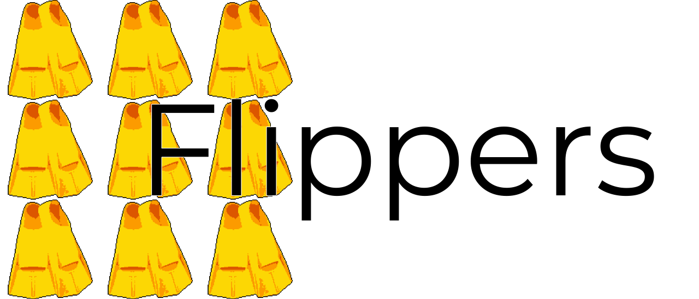

`flippers` is a Python library for weak supervision, which allows you to leverage your domain knowledge, heuristics and other weak supervision sources to generate high-quality labels for your training data. 

# Features
`flippers` includes a number of features for weak supervision, including:
- Simple tools to analyse your labeling functions,
- Multiple label models including a from-scratch implementation of the label model used in the `snorkel` library and featuring enhanced ways to predict probabilities,
- An extensive [documentation](https://flippers.readthedocs.io/en/latest/) with [tutorials](missing_link) and an [API reference](https://flippers.readthedocs.io/en/latest/reference/flippers.html).

# Installation
To install the latest version of `flippers`, simply run:

```bash
pip install flippers
```

# Quick Start 
## Documentation
To quickly get started with `flippers`, you can begin by exploring the [documentation](https://flippers.readthedocs.io/en/latest/) and running through the [examples](missing_link) provided. The examples cover a variety of use cases and techniques, which can help you to get a feel for how to apply `flippers` to your own projects. 
## Example
- Analyzing your labeling functions:
```python
analysis = flippers.analyis(L_train)
```
- Training a Label Model and doing inference:

```python
label_model = flippers.models.SnorkelModel(polarities,  class_balances)

label_model.fit(L_train)

label_model.predict_proba(L)
```

# Discussion
## Troubleshooting
If you have any questions or issues with `flippers`, please consult the [documentation](https://flippers.readthedocs.io/en/latest/) or reach out in the [GitHub issues](https://github.com/liamtoran/flippers/issues) page for support.


## Contributing

`flippers` is an open-source project, and contributions are welcome!

## Related projects
- [wrench](https://github.com/JieyuZ2/wrench): A weak supervision library created by for benchmarking label models and weak supervision techniques. `flippers` uses its list of datasets as benchmarks.  
- [snorkel](https://github.com/snorkel-team/snorkel): A cornerstone weak supervision library created by Snorkel in 2016, now sadly abandonned.

